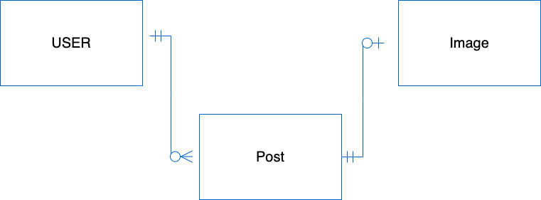

# Spotlight API Project 
A social media app that allow users to "SPOTLIGHT" a major current event, a special moment of their day, or just an image that provided a fleeting moment of joy and share it with others.

## User Story
<ul>
    <li>As an unregistered user, I would like to: view all images</li>
    <li> As an unregistered user, I would like to sign up with email and password. </li>
    <li>As a registered user, I would like to sign in with email and password.</li>
    <li>As a signed in user, I would like to change password.</li>
    <li>As a signed in user, I would like to sign out.</li>
    <li>As a signed in user, I would like to upload an image to AWS with a name</li>
    <li>As a signed in user, I would like to update the name of my image on AWS.</li>
    <li>As a signed in user, I would like to see all my images on AWS.</li>
    <li>As a signed in user, I would like to see the thumbnail of all images on AWS.</li>
    <li>As a signed in user, I would like to delete the reference of my image from the database.</li>
    <li>Each Post will have: </li>
    <li>
    <ul>
    <li>date created/uploaded</li>
    <li>date modified</li>
    <li>owner (user who created the post)</li>
    <li>name</li>
    </ul>
    </li>
</ul>

### Reach Goals
- As an unregistered user, I would like to download any image
- As a signed in user, I would like to 'like' images
- As a signed in user, I would like to comment on images
- As a signed in user, I would like to delete owner's comments
- As a signed in user, I would like to update owner's comments
- As a signed in user, i would like to follow another user **
- As a signed in user, i would like to share another user's post **

## Technology
We will be using React for our front end with RESTful routes and Moongose Express for our back end with CRUD actions. The app will use AWS to store the uploaded images, MongoDB Atlas as the database, and Heroku to launch.

## ERD

## Wireframes

## Route Table

### Authentication
| Verb   | URI Pattern         | Controller#Action |
| ------ | ------------------- | ----------------- |
| POST   | `/sign-up`          | `users#signup`    |
| POST   | `/sign-in`          | `users#signin`    |
| PATCH  | `/change-password/` | `users#changepw`  |
| DELETE | `/sign-out/`        | `users#signout `  |

### USER'S POST
| Verb   | URI Pattern | Controller#Action    |
| ------ | ----------- | -------------------- |
| GET    | `/`         | `other users' index` |
| GET    | `/:userId`  | `my index`           |
| POST   | `/`         | `add`                |
| PATCH  | `/:postId`  | `update`             |
| DELETE | `/:postId`  | `destroy`            |

### COMMENT
| Verb   | URI Pattern           | Controller#Action |
| ------ | --------------------- | ----------------- |
| POST   | `/:postId/:commentId` | `add`             |
| PATCH  | `/:postId/:commentId` | `update`          |
| DELETE | `/:postId/:commentId` | `destroy`         |

## Schema
### User
- email: string
    - required
    - unique
- username: string
    - required
    - unique
- hashedPassword: string
    - required
- token: string ???
- timestamps
    
### Post
- title: string
- caption: string
- image: url(?) w aws
- like: boolean (reach goal)
- follow: boolean (reach goal)
- timestamp:
- owner: mongoose.Schema.Types.ObjectId
    required

### Comment (sub-schema)
- comment: string (reach goal)

## Development Roles 
- Front End SME: Trevor Zou
- Back End SME: Shai Aloni 
- Team Manage: Dang Do